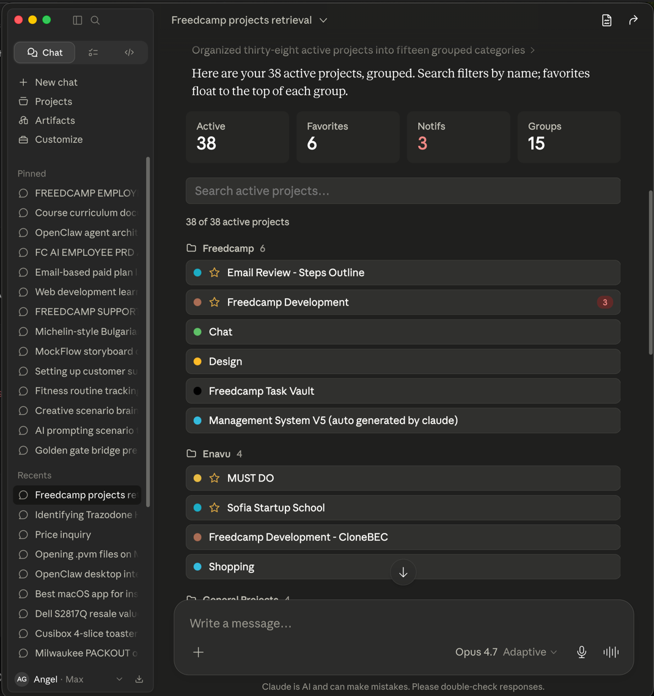

# Freedcamp MCP Server



MCP Server for the [Freedcamp](https://freedcamp.com) API, enabling project management, task tracking, time logging, CRM, and more through Claude and other MCP clients.

## Setup

### API Credentials

1. Log in to your Freedcamp account
2. Go to **Settings → API** to generate your API key and secret
3. Set the environment variables:

```bash
export FREEDCAMP_API_KEY=your_api_key
export FREEDCAMP_API_SECRET=your_api_secret
```

### Usage with Claude Desktop

Add the following to your `claude_desktop_config.json`:

```json
{
  "mcpServers": {
    "freedcamp": {
      "command": "npx",
      "args": ["-y", "freedcamp-mcp-server"],
      "env": {
        "FREEDCAMP_API_KEY": "<YOUR_API_KEY>",
        "FREEDCAMP_API_SECRET": "<YOUR_API_SECRET>"
      }
    }
  }
}
```

### Usage with VS Code

Add to your User Settings (JSON) or `.vscode/mcp.json`:

```json
{
  "mcp": {
    "inputs": [
      { "type": "promptString", "id": "fc_key", "description": "Freedcamp API Key", "password": true },
      { "type": "promptString", "id": "fc_secret", "description": "Freedcamp API Secret", "password": true }
    ],
    "servers": {
      "freedcamp": {
        "command": "npx",
        "args": ["-y", "freedcamp-mcp-server"],
        "env": {
          "FREEDCAMP_API_KEY": "${input:fc_key}",
          "FREEDCAMP_API_SECRET": "${input:fc_secret}"
        }
      }
    }
  }
}
```

---

## Tools

All tools are prefixed with `fc_`.

### Projects

| Tool | Description |
|------|-------------|
| `fc_fetch_projects` | List all projects |
| `fc_fetch_project` | Get a single project (`project_id`) |
| `fc_fetch_recent_project_ids` | Get recently accessed project IDs |
| `fc_add_project` | Create a project (`project_name`, optional: `project_description`, `project_color`, `group_id`) |
| `fc_edit_project` | Edit a project (`project_id`, optional: `project_name`, `project_color`, `group_id`) |
| `fc_leave_project` | Leave a project (`membership_id`) |
| `fc_delete_project` | Delete a project (`project_id`) |
| `fc_add_favorite_project` | Add project to favorites (`project_id`) |
| `fc_delete_favorite_project` | Remove project from favorites (`project_id`) |
| `fc_fetch_overview` | Get project overview (`project_id`) |

### Tasks

| Tool | Description |
|------|-------------|
| `fc_fetch_task` | Get a task by ID (`task_id`) |
| `fc_fetch_tasks` | List tasks (`project_id`, optional: `limit`, `offset`, `filters`) |
| `fc_add_task` | Create a task (`title`, `project_id`, optional: `description`, `task_group_id`, `priority`, `assigned_to_id`, `due_date`, `status`) |
| `fc_update_task` | Update a task (`task_id`, optional: `title`, `description`, `status`, `priority`, `assigned_to_id`, `due_date`) |
| `fc_delete_task` | Delete a task (`task_id`) |

**Task filters** (passed inside `filters` object):
- `status`: array of `STATUS_NOT_STARTED`, `STATUS_COMPLETED`, `STATUS_IN_PROGRESS`, `STATUS_INVALID`, `STATUS_REVIEW`
- `assigned_to_id`: array of user IDs
- `due_date_from` / `due_date_to`: date strings
- `created_date_from` / `created_date_to`: date strings

### Lists

| Tool | Description |
|------|-------------|
| `fc_fetch_lists` | Get lists for a project (`project_id`, optional: `app_id`) |
| `fc_add_list` | Create a list (`project_id`, `title`, optional: `app_id`, `description`) |
| `fc_edit_list` | Edit a list (`list_id`, `title`, optional: `app_id`, `description`) |
| `fc_delete_list` | Delete a list (`list_id`, optional: `app_id`) |

### Comments

| Tool | Description |
|------|-------------|
| `fc_add_comment` | Add a comment (`item_id`, `app_id`, `description`, optional: `attached_ids`) |
| `fc_edit_comment` | Edit a comment (`comment_id`, `description`) |
| `fc_delete_comment` | Delete a comment (`comment_id`) |

### Calendar Events

| Tool | Description |
|------|-------------|
| `fc_fetch_events` | List events (optional: `project_id`) |
| `fc_fetch_event` | Get an event (`event_id`) |
| `fc_add_event` | Create an event (`project_id`, `title`, `start_date`, optional: `description`, `f_all_day`, `end_date`, `r_rule`, `mixed_users`) |
| `fc_edit_event` | Edit an event (`event_id`, optional fields) |
| `fc_delete_event` | Delete an event (`event_id`) |
| `fc_fetch_calendar_items` | List calendar items for a project (optional: `project_id`) |

### Discussions

| Tool | Description |
|------|-------------|
| `fc_fetch_discussions` | List discussions (`project_id`, optional: `limit`, `offset`) |
| `fc_fetch_discussion` | Get a discussion (`discussion_id`) |
| `fc_add_discussion` | Create a discussion (`title`, `project_id`, optional: `description`, `list_id`, `f_sticky`, `f_private`) |
| `fc_edit_discussion` | Edit a discussion (`discussion_id`, optional fields) |
| `fc_delete_discussion` | Delete a discussion (`discussion_id`) |

### Issues

| Tool | Description |
|------|-------------|
| `fc_fetch_issues` | List issues (`project_id`, optional: `limit`, `offset`) |
| `fc_fetch_issue` | Get an issue (`issue_id`) |
| `fc_add_issue` | Create an issue (`title`, `project_id`, optional: `description`, `priority`, `status`, `type`, `assigned_to_id`, `due_date`) |
| `fc_edit_issue` | Edit an issue (`issue_id`, optional fields) |
| `fc_delete_issue` | Delete an issue (`issue_id`) |

### Milestones

| Tool | Description |
|------|-------------|
| `fc_fetch_milestones` | List milestones (`project_id`, optional: `limit`, `offset`) |
| `fc_fetch_milestone` | Get a milestone (`milestone_id`) |
| `fc_add_milestone` | Create a milestone (`title`, `project_id`, optional: `description`, `priority`, `assigned_to_id`, `due_date`, `start_date`) |
| `fc_edit_milestone` | Edit a milestone (`milestone_id`, optional fields) |
| `fc_delete_milestone` | Delete a milestone (`milestone_id`) |

### Time Tracking

| Tool | Description |
|------|-------------|
| `fc_fetch_times` | List time entries (`project_id`, optional: `limit`, `offset`) |
| `fc_fetch_time` | Get a time entry (`time_id`) |
| `fc_add_time` | Log time (`project_id`, `date`, `minutes_count`, optional: `description`, `assigned_to_id`, `f_started`, `f_billed`) |
| `fc_edit_time` | Edit a time entry (`time_id`, optional fields) |
| `fc_delete_time` | Delete a time entry (`time_id`) |
| `fc_time_action` | Perform action on a timer (`time_id`, `action`: `start`/`stop`/`bill`/`unbill`) |

### Wikis

| Tool | Description |
|------|-------------|
| `fc_fetch_wikis` | List wikis (`project_id`, optional: `limit`, `offset`, `order_title`) |
| `fc_fetch_wiki` | Get a wiki (`wiki_id`) |
| `fc_add_wiki` | Create a wiki (`title`, `project_id`, optional: `description`, `list_id`, `f_private`, `f_public`) |
| `fc_edit_wiki` | Edit a wiki (`wiki_id`, optional fields) |
| `fc_delete_wiki` | Delete a wiki (`wiki_id`) |
| `fc_add_wiki_version` | Add a wiki version (`wiki_id`, optional: `title`, `description`) |

### CRM Tasks

| Tool | Description |
|------|-------------|
| `fc_fetch_crm_tasks` | List CRM tasks (`group_id`, optional: `limit`, `offset`) |
| `fc_fetch_crm_task` | Get a CRM task (`crm_task_id`) |
| `fc_add_crm_task` | Create a CRM task (`title`, `group_id`, optional: `description`, `type`, `assigned_to_id`, `due_date`) |
| `fc_edit_crm_task` | Edit a CRM task (`crm_task_id`, optional fields) |
| `fc_delete_crm_task` | Delete a CRM task (`crm_task_id`) |

### CRM Calls

| Tool | Description |
|------|-------------|
| `fc_fetch_crm_calls` | List CRM calls (`group_id`, optional: `limit`, `offset`) |
| `fc_fetch_crm_call` | Get a CRM call (`crm_call_id`) |
| `fc_add_crm_call` | Create a CRM call (`title`, `group_id`, optional: `description`, `f_inbound`, `assigned_to_id`, `due_date`, `duration`) |
| `fc_edit_crm_call` | Edit a CRM call (`crm_call_id`, optional fields) |
| `fc_delete_crm_call` | Delete a CRM call (`crm_call_id`) |

### Users & Account

| Tool | Description |
|------|-------------|
| `fc_fetch_users` | List all users |
| `fc_fetch_current_user` | Get the authenticated user |
| `fc_fetch_user` | Get a user by ID (`user_id`) |
| `fc_update_current_user` | Update profile (`first_name`, `last_name`, `email`, `timezone`, `password`) |
| `fc_register_user` | Register a new user (`email`, `password`, `first_name`, `last_name`) |
| `fc_delete_avatar` | Delete current user avatar |
| `fc_delete_account` | Delete the account (`password`) |
| `fc_request_password_reset` | Request password reset email (`email`) |
| `fc_apply_password_reset` | Apply password reset (`reset_key`, `password`) |
| `fc_validate_email` | Validate an email address (`email`) |

### Groups & Notifications

| Tool | Description |
|------|-------------|
| `fc_fetch_groups` | List all groups |
| `fc_fetch_notifications` | Get recent notifications |
| `fc_fetch_notifications_by_project` | Get notifications for a project (`project_id`) |
| `fc_update_notification_read` | Mark notification as read (optional: `uid`) |
| `fc_edit_notifications` | Bulk update notification state (`items`, optional: `new_state`) |

### Miscellaneous

| Tool | Description |
|------|-------------|
| `fc_fetch_cf_templates` | List custom field templates (optional: `module_id`) |
| `fc_fetch_linked_items` | Get linked items (`app_id`, `item_id`) |
| `fc_add_linked_items` | Link items together (`app_id`, `item_id`, `links`) |
| `fc_fetch_current_session` | Get current session info |
| `fc_fetch_invitations` | List pending invitations |
| `fc_respond_invitation` | Respond to an invitation (`invitation_id`, optional: `action`, `response`) |
| `fc_fetch_timezones` | List available timezones |
| `fc_fetch_backups` | List account backups |

---

## License

MIT
